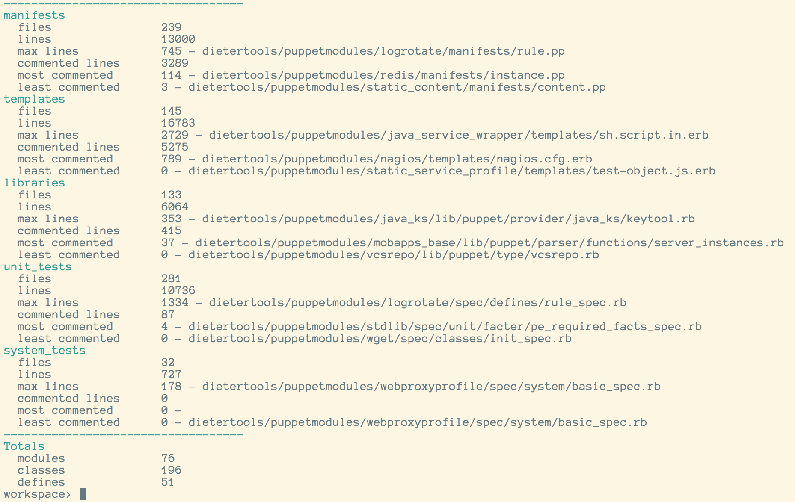

# pp-stats

Command line ruby program that generates stats for Puppet module(s).

## Install

Get it from rubygems

```
$ gem install pp-stats
```

## Usage

With no arguments, `pp-stats` assumes you're in a directory full of Puppet modules. Alternatively, provide a path to a directory of Puppet modules.

```
$ pp-stats ~/workspace/corp/puppet
```



## Credit

This tool was originally developed by Adam Denning ([adenning](https://github.com/adenning/pp-stats)).

When I found it, the repo only had a single commit almost one year old. It provided a very good starting point, so I have forked it and added some bits for my own needs. I have kept Adam's initial commit for posterity and I have added an [MIT License](LICENSE.txt) for good measure.
